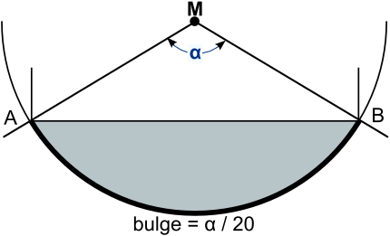

# The FontoBene Font Format, Version 1.0-WIP

## Introduction

FontoBene is a vector font format. It only uses strokes to form glyphs, in
order for easy rendering in systems that cannot easily deal with more complex
parts of formats like TTF or OTF, like Bézier curves.

FontoBene was designed with the use case of text on printed circuit boards
(PCBs) in mind. PCBs are usually manufactured using the Gerber format as an
exchange format to describe the etching layers, which does not support
quadratic / cubic curves.

The main inspiration for this font format was the LFF font used by LibreCAD.

## High Level Format Description

Every FontoBene font file consists of UTF-8 encoded text. The lines are
separated by newlines (U+000A LINE FEED). It starts with a header, followed by
glyph definitions.

Comments are allowed everywhere in the file. A comment line MUST start with a
number sign (`#`). Everything on that line will be ignored by the parser.
Inline comments are not allowed.

### Header

The header consists of INI style sections with key-value pairs. Key and value
are separated by an equal sign (`=`). Both keys and values are strings. All
whitespace around keys and values should be stripped. Sections are separated by
at least one empty line.

There are currently three sections defined: `[format]`, `[font]` and `[user]`.
The `[format]` and `[font]` sections may only contain keys standardized in this
specification (see section "Formal Specification"). The `[user]` section may
contain arbitrary key value pairs.

Example:

    [format]
    format = FontoBene
    format_version = 1.0

    [font]
    name = LibrePCB Font
    id = librepcb
    author = Max Müller <max@example.com>
    version = 1.0
    license = GPL-3.0+

    [user]
    comment = This is the official font used for LibrePCB projects.

    ---

### Body

The header is separated from the body by three hyphens (U+002D HYPHEN-MINUS) on
a single line (`---`). The body consists of glyph definition blocks separated
by at least one empty line.

Every glyph definition starts with the glyph declaration, a unicode codepoint
in square brackets (e.g. `[1F4A9]` for the pile of poo character). It may
optionally be followed by a UTF-8 representation of the character for easier
previewing (e.g. `💩`). However, that preview will be ignored by the parser.

The notation used inside the brackets follows the convention described in [*The
Unicode Standard, Version 10.0, Appendix A, Notational Conventions, Code
Points*][unicode-10-spec]:

> In running text, an individual Unicode code point is expressed as U+n, where
> n is four to six hexadecimal digits, using the digits 0–9 and uppercase
> letters A–F (for 10 through 15, respectively).
>
> Leading zeros are omitted, unless the code point would have fewer than four
> hexadecimal digits—for example, U+0001, U+0012, U+0123, U+1234, U+12345,
> U+102345.
>
> The U+ may be omitted for brevity in tables or when denoting ranges.

The glyph declaration is followed by a list of polylines or glyph references,
each on a single line.

#### Polylines

A polyline looks like this:

    0,0;3,9;6,0

It consists of coordinate pairs, separated by semicolons (`;`). The X and Y
coordinates are separated with a comma (`,`).  The coordinates are arbitrary
precision floating point numbers using the full stop (U+002E) as decimal mark.
If a coordinate is a whole number, the decimal mark and the fractional part of
the number may be omitted. If the integer part is zero and there is a fractional
part, the zero may be omitted (e.g. `-.5` instead of `-0.5`).

The coordinate system starts at the lower left corner. Positive X coordinates
point to the right. Positive Y coordinates point to the top. Negative
coordinates are not allowed.

          Y
    (0,Y) +
          |
          |
          +-----+ X
      (0,0)   (X,0)

The example above would draw the pointy "outer frame" of the character "A".
Here is the complete definition of the glyph for the character "LATIN CAPITAL
LETTER A (U+0041)":

    [0041] A
    0.8333,2.5;5.1666,2.5
    0,0;3,9;6,0

##### Circular Arc Segments

In addition to straight lines, polylines can contain circular arc segments.
This is done by adding a third parameter, called *bulge*, to the coordinate
pair of the end coordinate of an arc segment. It specifies the central angle of
the circular arc segment. The bulge is a value from -9 to +9 and represents an
angle in degrees from -180° to +180°. A positive angle describes a counter
clockwise arc segment from the start point to the end point, while a negative
angle describes a clockwise arc segment. If an arc segment with more than 180°
is required, it must be split up into two smaller arc segments.

Example:

    [0066] f
    1,0;1,7.5;2.5,9,-4.5;3,9
    0,6;3,6

#### References

Because many glyphs are very similar, references may be used as "includes".
References start with the "@" symbol (U+0040), followed by a codepoint. Here is
the definition of the glyph for the character "LATIN CAPITAL LETTER A WITH
CIRCUMFLEX (U+00C2)":

    [00C2] Â
    @0041
    1.5,11.5;3,13;4.5,11.5

An implementation would simply replace the "@0041" part with the expanded
polylines from the referenced glyph.

Multiple references can be used in a single glyph definition, but they must all
be on their own line.

To prevent reference loops and to facilitate single-pass parsers, only backward
references are allowed. All references glyphs must have been previously defined.

## Format Versioning

The FontoBene format follows [Semantic Versioning version 2][semver-2].

## Formal Specification

### Grammar (PEG)

TODO

### Standardized Headers

#### [format]

| Name | Description | Count | Example |
| --- | --- | --- | --- |
| format | The string "FontoBene". | 1 | `FontoBene` |
| format_version | The version of the FontoBene format that this file adheres to. | 1 | `1.1.2` |

#### [font]

| Name | Description | Count | Example |
| --- | --- | --- | --- |
| name | The name of this font. | 1 | `LibrePCB Font` |
| id | The identifier of this font. MUST only contain lowercase letters and minus characters. MUST start and end with a lowercase letter. | 1 | `librepcb` |
| version | The version of this font. SHOULD follow semantic versioning. | 1 | `0.4.1` |
| author | The name of the copyright owner, in the format `Name <email>`. The email part is optional. | 0-n | `Max Müller <max@foo>` |
| license | The SPDX identifier for the license of this font. Create multiple `License` entries if the font is published under multiple licenses. | 1-n | `Apache-2.0` |

[unicode-10-spec]: http://www.unicode.org/versions/Unicode10.0.0/UnicodeStandard-10.0.pdf
[semver-2]: http://semver.org/spec/v2.0.0.html
