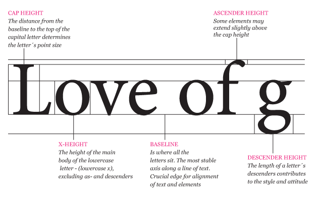

# The FontoBene Font Format, Version 1.0-WIP

## Contents

* [1. Introduction](#introduction)
* [2. Format Description](#format)
* [3. Font Layouting](#layouting)
* [4. Glyph Coordinate System](#coordinate-system)
* [5. Format Versioning](#versioning)
* [6. Formal Specification](#specification)

##  1. Introduction

FontoBene is a vector font format. It only uses strokes to form glyphs, in
order for easy rendering in systems that cannot easily deal with more complex
parts of formats like TTF or OTF, like Bézier curves.

FontoBene was designed with the use case of text on printed circuit boards
(PCBs) in mind. PCBs are usually manufactured using the Gerber format as an
exchange format to describe the etching layers, which does not support
quadratic / cubic curves.

The main inspiration for this font format was the LFF font used by LibreCAD.

##  2. Glyph Coordinate System

The coordinate system of glyphs starts at the lower left corner. Positive X
coordinates point to the right. Positive Y coordinates point to the top. A value
of 9 means 100% of the cap height (i.e. the coordinate system is scaled with
factor 9). This system leads to more compact font files as many coordinates can
be expressed by a single digit.

          Y
    (0,9) +
          |
          |
          +-----+ X
      (0,0)   (9,0)

Typical glyphs use the X axis (Y=0) as the baseline and are drawn mostly inside
the area (0,0)..(9,9). Coordinates outside this area are allowed, e.g. for
ascenders and descenders. In addition, typical glyphs are left aligned to the Y
axis (X=0). Glyphs that are not aligned to the Y axis have an impact on letter
spacing, see section "Letter Spacing" for details.

Following image illustrates where the baseline (Y=0) and cap height (Y=9) are
located:

##  3. Format Description

Every FontoBene font file consists of UTF-8 encoded text. The lines are
separated by newlines (U+000A LINE FEED). It starts with a header, followed by
glyph definitions.

Comments are allowed everywhere in the file. A comment line MUST start with a
number sign (`#`). Everything on that line will be ignored by the parser.
Inline comments are not allowed.

### 2.1. Header

The header consists of INI style sections with key-value pairs. Key and value
are separated by an equal sign (`=`). Both keys and values are strings. All
whitespace around keys and values should be stripped. Sections are separated by
at least one empty line.

There are currently three sections defined: `[format]`, `[font]` and `[user]`.
The `[format]` and `[font]` sections may only contain keys standardized in this
specification (see section "Formal Specification"). The `[user]` section may
contain arbitrary key value pairs.

Example:

    [format]
    format = FontoBene
    format_version = 1.0

    [font]
    id = librepcb
    name = LibrePCB Font
    description = This is the default font of LibrePCB.
    author = Max Müller <max@example.com>
    version = 1.0
    license = GPL-3.0+
    letter_spacing = 1.8
    line_spacing = 16

    [user]
    last_modified = 2012-12-21
    todo = Add U+03A9 (GREEK CAPITAL LETTER OMEGA)

    ---

### 2.2. Body

The header is separated from the body by three hyphens (U+002D HYPHEN-MINUS) on
a single line (`---`). The body consists of glyph definition blocks separated
by at least one empty line.

Every glyph definition starts with the glyph declaration, a unicode codepoint
in square brackets (e.g. `[1F4A9]` for the pile of poo character). It may
optionally be followed by a UTF-8 representation of the character for easier
previewing (e.g. `💩`). However, that preview will be ignored by the parser.

The notation used inside the brackets follows the convention described in [*The
Unicode Standard, Version 10.0, Appendix A, Notational Conventions, Code
Points*][unicode-10-spec]:

> In running text, an individual Unicode code point is expressed as U+n, where
> n is four to six hexadecimal digits, using the digits 0–9 and uppercase
> letters A–F (for 10 through 15, respectively).
>
> Leading zeros are omitted, unless the code point would have fewer than four
> hexadecimal digits—for example, U+0001, U+0012, U+0123, U+1234, U+12345,
> U+102345.

In contrast to the Unicode Standard, in FontoBene the `U+` prefix MUST NOT be
used.

The glyph declaration is followed by a list of glyph references, polylines or
whitespace definitions, each on a single line. The order and quantity of these
three things MUST be as following:

1. 0-n references (e.g. `@0041`)
2. 0-n polylines (e.g. `1,0;1,7.5,-4.5;2.5,9;3,9`)
3. 0-1 whitespace definitions (e.g. `~3.6`)

#### 2.2.1. Polylines

A polyline looks like this:

    0,0;3,9;6,0

It consists of coordinate pairs, separated by semicolons (`;`). The X and Y
coordinates are separated with a comma (`,`).  The coordinates are arbitrary
precision floating point numbers using the full stop (U+002E) as decimal mark.
If a coordinate is a whole number, the decimal mark and the fractional part of
the number may be omitted. If the integer part is zero and there is a fractional
part, the zero may be omitted (e.g. `-.5` instead of `-0.5`).

Here is the complete definition of the glyph for the character "LATIN CAPITAL
LETTER A (U+0041)":

    [0041] A
    0.8333,2.5;5.1666,2.5
    0,0;3,9;6,0

##### 2.2.1.1. Circular Arc Segments

In addition to straight lines, polylines can contain circular arc segments.
This is done by adding a third parameter, called *bulge*, to the **start
coordinate** of the arc segment. It specifies the central angle of the circular
arc segment. The bulge is a value from -9 to +9 and represents an angle in
degrees from -180° to +180°. A positive angle describes a counter clockwise arc
segment from the start point to the end point, while a negative angle describes
a clockwise arc segment. If an arc segment with more than 180° is required, it
must be split up into two smaller arc segments.

Example:

    [0066] f
    1,0;1,7.5,-4.5;2.5,9;3,9
    0,6;3,6

#### 2.2.2. References

Because many glyphs are very similar, references may be used as "includes".
References start with the "@" symbol (U+0040), followed by a codepoint. Here is
the definition of the glyph for the character "LATIN CAPITAL LETTER A WITH
CIRCUMFLEX (U+00C2)":

    [00C2] Â
    @0041
    1.5,11.5;3,13;4.5,11.5

An implementation would simply replace the "@0041" part with the expanded
polylines from the referenced glyph.

Multiple references can be used in a single glyph definition, but they must all
be on their own line.

To prevent reference loops and to facilitate single-pass parsers, only backward
references are allowed. All references glyphs must have been previously defined.

#### 2.2.3. Whitespaces

Some glyphs need additional whitespace following the glyph, or even consist of
only whitespace (no polylines). The width of this whitespace can be specified
for every glyph with the `~` sign (U+007E TILDE), followed by the desired width
in the same unit as polylines.

The most important space glyph (which every font file should contain) is " "
(U+0020 SPACE). A typical font may use a width of 3.6 (40% of font height):

    [0020] SPACE
    ~3.6

As global letter spacing is applied to every glyph (including whitespace glyphs),
the total whitespace is the addition of both values (e.g. 3.6 + 1.8 = 5.4).

Whitespace definitions are also inherited when referencing other glyphs (with
"@", see above). If a glyph has multiple whitespace definitions (either direct
or via references), only the last definition will be used by the parser.
Inherited space definitions can be discarded by overriding them with `~0`.

##  3. Font Layouting

Generally, letter spacing (horizontal) and line spacing (vertical) depends on
the specific use-case and thus it's up to the application's font layout engine
to determine the exact spacing values.

But to support layout engines in determining suitable letter spacing and line
spacing values, FontoBene allows to specify some spacing information directly in
font files. This information helps to get nice looking texts with very low
effort.

Both letter spacing and line spacing values are given in the same unit as
polylines (9 = 100% of cap height).

### 3.1. Letter Spacing

Letter spacing is the horizontal space between two consecutive glyphs. There are
three different options which allow to control letter spacing:

1. **Global Letter Spacing:**

   The parameter `letter_spacing` in the `[font]` section of the header defines
   the letter spacing which should be put after every letter. A typical font may
   use a letter spacing value of 1.8 (20% of font height).

2. **Leading space of glyphs:**

   Typically every glyph should start on the X-coordinate 0 (i.e. the leftmost
   coordinate of every glyph is placed on X-coordinate 0). But if a specific
   glyph requires more or less spacing in front of it, the font designer can
   place such glyphs slightly more left or right to make the leftmost point of
   the glyph either slightly negative (reduce leading space) or slightly
   positive (increase leading space).

3. **Trailing space of glyphs:**

   Glyphs can also adjust the trailing space by using the `~` sign for
   specifying additional spacing (see section "Whitespaces" above).

The total space between two letters is calculated by the addition of these three
parameters:

1. Trailing space of first letter (`~` space definition)
2. Global letter spacing (`letter_spacing` from header)
3. Leading space (leftmost X-coordinate) of second letter

### 3.2. Line Spacing

Line spacing is the vertical distance between the baselines of a multiline text.
It can be defined with the `line_spacing` key in the header. A suitable value
depends on the height of ascenders and descenders to avoid vertically
overlapping characters. So the `line_spacing` value should be set to a value
slightly greater than the addition of the cap height (9), highest ascender
height and highest descender height. For a typical font this may be around 16
(178% of cap height).

### 3.3. Stroke Width

Even if FontoBene is a stroke font, it doesn't specify the stroke width. It's up
to the application to choose a suitable stroke width (typically between 0% and
30% of the text height). For the font designer it's important to always specify
letter spacing and line spacing values for a stroke width of 0 to make fonts
interchangeable. Applications may need to increase these spacing values
accordingly when using thicker strokes.

##  4. Glyph Coordinate System

The coordinate system of glyphs starts at the lower left corner. Positive X
coordinates point to the right. Positive Y coordinates point to the top. A value
of 9 means 100% of the cap height (i.e. the coordinate system is scaled with
factor 9). This system leads to more compact font files as many coordinates can
be expressed by a single digit.

          Y
    (0,9) +
          |
          |
          +-----+ X
      (0,0)   (9,0)

Typical glyphs use the X axis (Y=0) as the baseline and are drawn mostly inside
the area (0,0)..(9,9). Coordinates outside this area are allowed, e.g. for
ascenders and descenders. In addition, typical glyphs are left aligned to the Y
axis (X=0). Glyphs that are not aligned to the Y axis have an impact on letter
spacing, see section "Letter Spacing" for details.

Following image illustrates where the baseline (Y=0) and cap height (Y=9) are
located:

##  5. Format Versioning

The FontoBene format follows [Semantic Versioning version 2][semver-2].

##  6. Formal Specification

### 6.1. Grammar (PEG)

TODO

### 6.2. Standardized Headers

**[format]**

| Name | Description | Count | Example |
| --- | --- | --- | --- |
| format | The string "FontoBene". | 1 | `FontoBene` |
| format_version | The version of the FontoBene format that this file adheres to. | 1 | `1.1.2` |

**[font]**

| Name | Description | Count | Example |
| --- | --- | --- | --- |
| id | The identifier of this font. MUST only contain lowercase letters and minus characters. MUST start and end with a lowercase letter. | 1 | `librepcb` |
| name | The name of this font. | 1 | `LibrePCB Font` |
| description | Short description about this font (optional). | 0-1 | `This is an example.` |
| version | The version of this font. SHOULD follow semantic versioning. | 1 | `0.4.1` |
| author | The name of the copyright owner, in the format `Name <email>`. The email part is optional. | 0-n | `Max Müller <max@foo>` |
| license | The SPDX identifier for the license of this font. Create multiple `license` entries if the font is published under multiple licenses. | 1-n | `Apache-2.0` |
| letter_spacing | Global letter space width for every glyph. Same unit as for polylines. If not specified, 0 is assumed (no space). | 0-1 | `1.8` (= 20% of font height) |
| line_spacing | Vertical baseline distance of multiline texts. Same unit as for polylines. If not specified, 9 is assumed (no space). | 0-1 | `16` (= 178% of font height) |

[unicode-10-spec]: http://www.unicode.org/versions/Unicode10.0.0/UnicodeStandard-10.0.pdf
[semver-2]: http://semver.org/spec/v2.0.0.html
